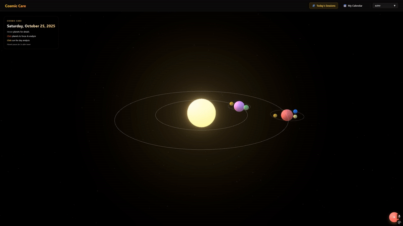

# Cosmic Care 🌌

Live Site: [Cosmic Care](https://cosmiccare.vercel.app/)

## Table of Contents

- [Overview](#overview)
- [Technologies](#technologies)
- [Libraries & Methodologies](#libraries--methodologies)
- [Features](#features)
- [TODOS/Features to Implement](#todosfeatures-to-implement)
- [Author Info](#author-info)

## Overview

Welcome to **Cosmic Care**, an innovative emotional wellness web app that transforms your daily emotional journey into an interactive 3D solar system experience. Track your emotional states across morning, afternoon, and evening sessions while visualizing your emotional patterns through stunning 3D graphics and intuitive calendar views.

The app features a **3D Solar System Visualization** where each planet represents a daily session, and emotional states orbit as moons around their respective planets. Users can explore their emotional data through both immersive 3D interactions and comprehensive calendar analytics.
The **Calendar View** provides a GitHub-style heatmap showing emotional intensity patterns over time, with color-coded gradients representing positive, negative, and balanced emotional states.

  

## Technologies

- **Frontend:** Next.js, React, TypeScript
- **3D Graphics:** Three.js, React Three Fiber, @react-three/drei
- **Styling:** TailwindCSS
- **Backend:** Supabase (PostgreSQL, Authentication)
- **AI Integration:** Gemini API
- **Audio Processing**: Web Audio API for recording, OpenAI Whisper for transcription
- **Deployment:** Vercel

## Features

- **3D Solar System Visualization**: Interactive planets and moons representing emotional states
- **Session-based Emotional Tracking**: Morning, afternoon, and evening emotional monitoring
- **Calendar Heatmap**: GitHub-style visualization of emotional patterns over time
- **Audio Recording & Transcription**: Voice-based emotional logging with AI transcription
- **Emotion Analysis**: AI-powered emotion detection and intensity scoring
- **User Authentication**: Secure signup, signin, and profile management
- **Responsive Design**: Optimized for desktop and mobile experiences
- **Real-time Data Sync**: Live updates across all visualization components
- **Color-coded Analytics**: Intuitive visual representation of emotional states

## TODOS/Features to Implement

- [ ] Add more visualization modes (charts, graphs, timeline views)

- [ ] Add voice emotion analysis for more accurate mood detection
- [ ] Implement data export functionality (PDF reports, CSV data)

## Author Info

Created by:

- **Shahed Ahmed** - [Portfolio](https://shahedahmed.vercel.app/) | [LinkedIn](https://www.linkedin.com/in/shahed-ahmed1/) | [GitHub](https://github.com/Shahed4)
- **Azim Rahat** - [Portfolio](https://azimrahat.com) | [LinkedIn](https://linkedin.com/in/azim-rahat) | [GitHub](https://linkedin.com/in/azim-rahat)
- **ATM Hossain** - [LinkedIn](https://www.linkedin.com/in/rahat-hossain-a32273201/) | [GitHub](https://github.com/ATMmonitor667)
- **Arihant Tiwari** - [LinkedIn](https://www.linkedin.com/in/arihanttiwari) | [GitHub](https://github.com/notprowler)

[Back to Top](#cosmic-care-)
